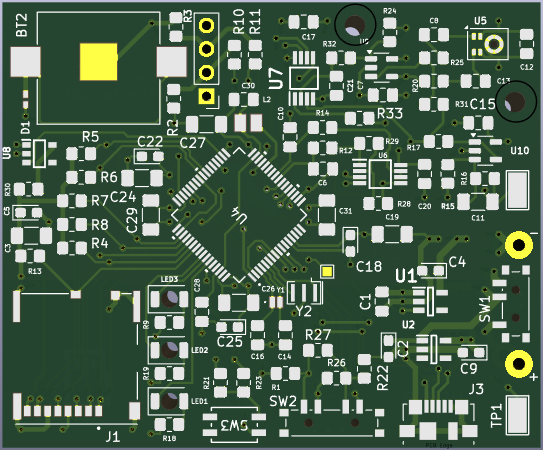
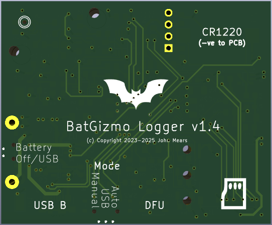
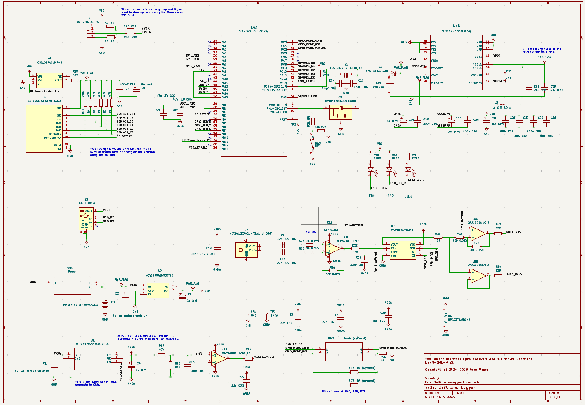

# BatGizmo Logger

This repo contains hardware design files for the BatGizmo Logger PCB, generated in KiCad, including the schematic, PCB layout, and local symbol/footprint libraries for the logger board.

  
  

These are static images and may be out of date. Open the project files in KiCad to see the most recent versions.

## What Is the BatGizmo Logger?

The BatGizmo Logger is an ultrasonic microphone that can be used for bat monitoring in two ways:

- Active monitoring, connected via USB to an Android phone or tablet with the [BatGizmo app](https://play.google.com/store/apps/details?id=uk.org.gimell.batgizmoapp) installed.
- Passive monitoring, powered by 3xAA batteries, capable of recording full-spectrum bat data to WAV files stored on an SD card.

## Board Contents

- STM32U5 series microcontroller
- MEMS microphone front end (Infineon IM73A135) with analog conditioning
- microSD connector for local data logging and configuration
- USB Micro-B connector for power and live audio data in active monitoring mode, plus direct firmware update
- Optional real-time clock powered by a CR1220 battery
- On-board mode switch options and status LEDs

## Getting Started

### Prerequisites

- KiCad 8.x (project files are generated with KiCad 8 format)

### Open the Design

1. Launch KiCad.
2. Open `BatGizmo-logger.kicad_pro`.
3. From the project window, open:
   - schematic editor for `BatGizmo-logger.kicad_sch`
   - PCB editor for `BatGizmo-logger.kicad_pcb`

### Regenerate Outputs

Use KiCad's built-in exporters as needed:

- **Schematic Editor** -> ERC, BOM export
- **PCB Editor** -> DRC, Gerbers, drill files, pick-and-place, fabrication docs

Generated fabrication/output artifacts are intentionally ignored in git (see `.gitignore`), so they can be recreated locally per release.

## License

This project is licensed under the **CERN Open Hardware License v2 - Permissive (CERN-OHL-P v2)**.

See `LICENSE.md` for the full text.

Copyright (c) 2024-2026 John Mears.

## Schematic

This is a static image and may be out of date. Open the project files in KiCad to see the most recent version.
